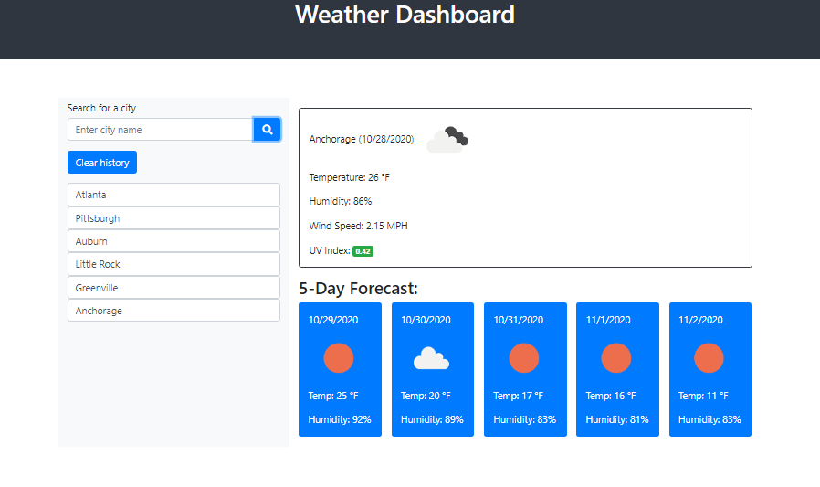

# Weather-Dashboard

This weather dashboard app allows the user to see the current weather conditions along with the a 5 day forcast using the OpenWeather API to retrieve weather data for cities.

## Description
The application will allow the user to save previously searched city names and enter new cities to see the weather conditions for the entered city.  

## Logic Requirements
* Using a weather dashboard with form inputs:
  * When a city is searched, the page will present current and future conditions for that city and that city is added to the search history.
  * When the user views the current weather conditions for that city, the user will be presented with the city name, the date, an icon representation of weather conidtions, the temperature, the humidity, the wind speed, and the UV index.
  * When the user is presented with the UV index, a color will be presented to indicate the conditions are favorable, moderate, or severe.
  * When the user views future weather conditions for that city, a 5-day forecast will be presented that displays the date, an icon representation of weather conditions, the temperature, and the humidity.
  * When the user clicks on a city in the search history, the user will be presented with current and future conditions for that city.
  * When the user opens the weather dashboard, the user is presented with the last searched city forecast.

## Built with
* HTML
* CSS
* Javascript and jQuery
* AJAX query request
* [Font Awesome Icon](fontawesome.com)
* [Visual Studio Code](code.visualstudio.com)
* [Openweather API](https://openweathermap.org/api)

## Website
https://drclever.github.io/Weather-Dashboard

## Weather Dashboard Image

